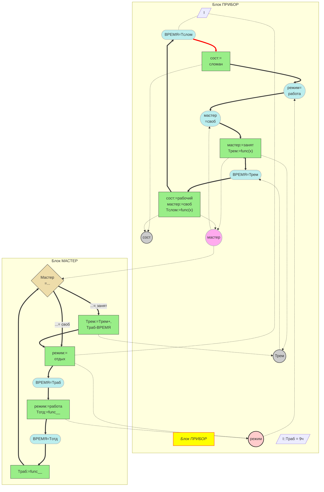

```mermaid
flowchart TD
subgraph pribor [Блок ПРИБОР]
    title[<em>Блок ПРИБОР</em>]
    h1(["BPEMЯ=Tслом"])==> h2["сост:=<br>сломан"]
    h2 e11@==> h3(["режим=<br>работа"])
    h3 ==> h4(["мастер<br>=своб"])
    h4 ==> h5["мастер:=занят<br>Tрем:=funс(x)"]
    h5 e20@==> h6(["ВРЕМЯ=Трем"])
    h6 ==> h7["сост:=рабочий<br>мастер:=своб<br>Tслом:=func(x)"]
    h7 e10@==> h1

    h2 -.->par3((сост))
    h7 -.->par3
    par1((режим))-.->h3
    par2((мастер))-.->h4
    h5 -.->par2
    h7 -.->par2
    h5 -.->par4((Трем))
    par4 -.-> h6
    Ini@{shape: braces, label: "I::"} -.- h1
    HTf@{shape: braces, label: "I::Tслом = 100"}

    classDef cond fill:#bee,stroke:#aaa,stroke-width:1px;
    classDef state fill:#9e8,stroke:#333,stroke-width:1px;
    class h5,h8,h2,h7 state;
    class h1,h3,h4,h6 cond;
    style title fill:yellow,stroke:red;

    click par2 href "https://iu5.bmstu.ru" "переход для Мастера" _blank;
    click par4 href "https://iu5.bmstu.ru" "переход для Tрем" _blank;
    style par1 fill:#fcc,stroke:#111,stroke-width:2px;
    style par2 fill:#fae,stroke:#bbb,stroke-width:2px;
    style par3 fill:#ccc,stroke:#555,stroke-width:2px;
    style par4 fill:#ccc,stroke:#555,stroke-width:2px;
    linkStyle 0 stroke:red,stroke-width:4px;

    e10@{ curve: linear}
    e11@{ curve: natural}
    e20@{ curve: stepAfter}
end

subgraph master [Блок МАСТЕР]
    h8["режим:=<br>отдых"]==> h9(["ВРЕМЯ=Tраб"])
    h9 ==> h10["режим:=работа<br>Tотд:=func__"]
    h10 ==> h11(["ВРЕМЯ=Tотд"])
    h11 ==> h12["Tраб:=func__"]
    h12 ==> h13{"Мастер<br>=..."}
    h13 ==>|"...= своб"| h8
    h13 ==> |"...= занят"|h14["Tрем:=Tрем+,<br>Tраб-ВРЕМЯ"]
    h14 ==> h8

    Ini@{shape: lean-r, label: "I"} -.- h8
    HTf@{shape: lean-r, label: "I::Tраб = 9ч"}

    h8 -.-> par1
    h10 -.-> par1
    par2 -.->h13
    h14 -.-> par4

    classDef cond fill:#bee,stroke:#aaa,stroke-width:1px;
    classDef state fill:#9e8,stroke:#333,stroke-width:1px;
    classDef navig fill:#eda,stroke:#333,stroke-width:1px;
    class h8,h10,h12,h14,h9 state;
    class h9,h11 cond;
    class h13 navig;
end
```